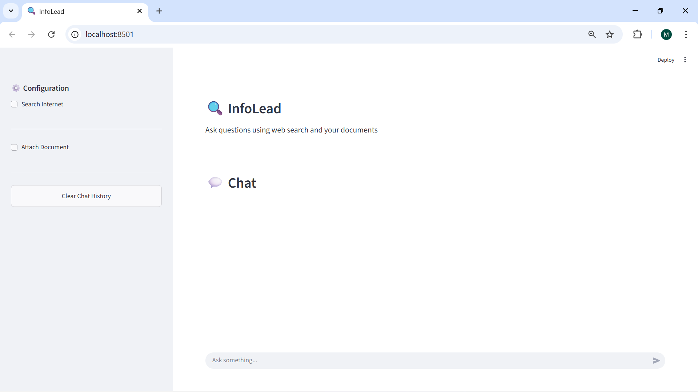
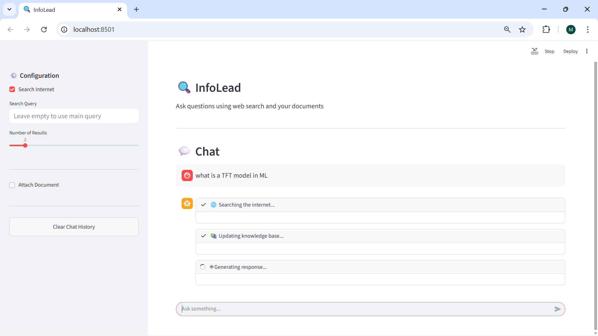

# InfoLead – Local Setup Instructions

This document describes how to run the InfoLead application locally with full functionality.

 
 

## Step 1: Install Ollama (Local LLM Runtime)

Ollama is required to run the Qwen model locally.

**Download and install Ollama from:**
https://ollama.com/download

Verify installation:

`ollama --version`

## Step 2: Get LlamaParse API Key (Document Parsing)

Document parsing uses LlamaParse from LlamaIndex Cloud.

**Get an API key from:**
https://cloud.llamaindex.ai

Steps:

**1. Sign in**

**2. Navigate to API Keys**

**3. Create a new API key**

## Step 3: Install Python Dependencies

**Create a virtual environment:**

`python -m venv venv`

Activate it:

`venv\Scripts\activate`

**Install dependencies:**

`pip install -r requirements.txt`

## Step 4: Start the Crawler Service (FastAPI)

The crawler service handles web scraping using crawl4ai.

**Run the crawler service:**

`uvicorn crawler_service:app --port 8000`

## Step 5: Start the Streamlit Application

**Open a new terminal, activate the same virtual environment, and run:**

`streamlit run app.py`
